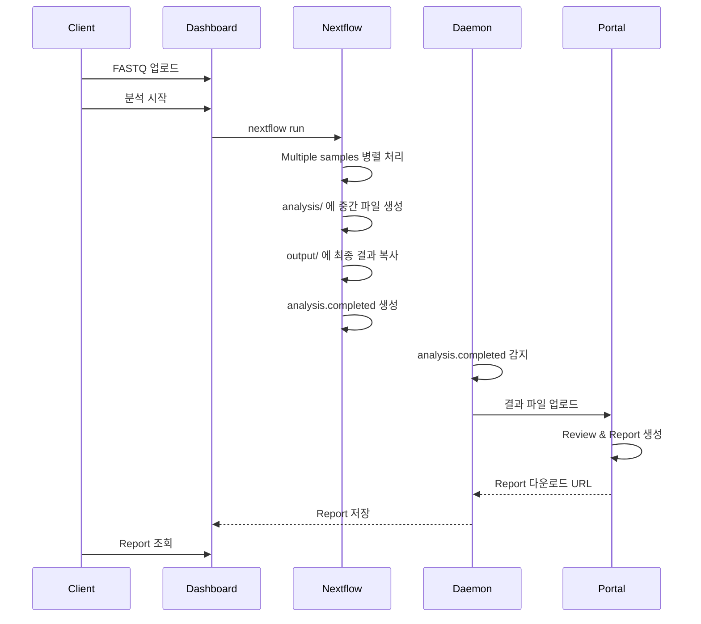
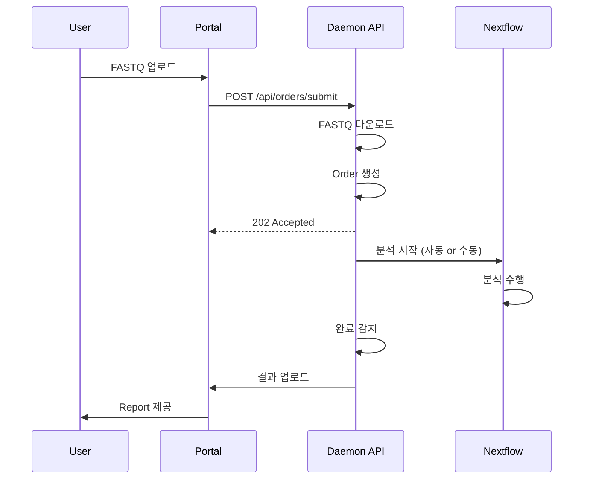

# 🎯 Dark Gene Pipeline - 최종 구현 보고서

## 📅 작업 완료 일시
**2026-01-21**

---

## 🎉 구현 완료 사항

### ✅ 1. All-in-One Docker Image
**위치**: `/home/ken/dark_gene_pipeline/Dockerfile`

하나의 Docker 컨테이너에 모든 구성 요소 통합:
- Dashboard (Flask, Port 5000)
- Daemon API (Flask, Port 8080)  
- Nextflow (Multiple sample 자동 병렬 처리)
- Supervisor (프로세스 관리)

**특징**:
- Client 서버에 간편 설치 (`./install.sh` 실행)
- Nextflow의 channel 기반 multiple sample 처리
- 자동 재시작 및 프로세스 관리

### ✅ 2. Dashboard Report Viewer
**위치**: `/home/ken/dark_gene_pipeline/dashboard/`

**추가된 기능**:
- `/view_report/<work_dir>/<sample_name>` - HTML Report 조회
- `/api/report/<work_dir>/<sample_name>` - Report 데이터 API
- 샘플 목록에 "📊 Report" 버튼 추가
- 분석 완료된 샘플의 Report를 새 탭에서 열기

**템플릿**:
- `report_viewer.html` - Report 표시 페이지
- `no_report.html` - Report 없을 때 안내 페이지

### ✅ 3. Order Submit API (Use Case 2)
**위치**: `/home/ken/dark_gene_pipeline/daemon/api_server.py`

**API 엔드포인트**:
```
POST /api/orders/submit
```

**기능**:
- Portal에서 Order 제출
- FASTQ URL로 파일 자동 다운로드
- Order 정보 관리
- Portal 상태 업데이트

**Request 예시**:
```json
{
  "order_id": "ORD-2026-001",
  "work_dir": "2601",
  "sample_name": "Sample_A10",
  "fastq_r1_url": "https://portal.com/files/xxx_R1.fastq.gz",
  "fastq_r2_url": "https://portal.com/files/xxx_R2.fastq.gz",
  "priority": "normal",
  "notify_email": "user@example.com"
}
```

### ✅ 4. 배포 자동화
**위치**: `/home/ken/dark_gene_pipeline/install.sh`

**기능**:
- 대화형 설치 스크립트
- 환경 변수 자동 설정
- 디렉토리 구조 생성
- Docker 이미지 빌드 및 실행
- Health check

**사용법**:
```bash
./install.sh
```

### ✅ 5. 통합 문서
**파일들**:
- `README_DOCKER.md` - 전체 사용 가이드
- `BUILD_GUIDE.md` - 상세 빌드 가이드
- `SYSTEM_STATUS.md` - 시스템 상태 보고서
- `DEPLOYMENT_STATUS.md` - 배포 상태
- `LOG_VIEWER_GUIDE.md` - 로그 조회 가이드

---

## 🔄 워크플로우

### Use Case 1: Client 서버 설치 (주요)



### Use Case 2: Portal 중심



---

## 📦 Docker 구조

```
┌─────────────────────────────────────────────┐
│  dark-gene-pipeline Container               │
│  (Single All-in-One Image)                  │
│                                             │
│  ┌────────────────────────────────────────┐│
│  │  Supervisor                            ││
│  │  ┌──────────────────────────────────┐ ││
│  │  │ Dashboard (gunicorn :5000)       │ ││
│  │  │ - Flask Web UI                   │ ││
│  │  │ - Report Viewer                  │ ││
│  │  └──────────────────────────────────┘ ││
│  │  ┌──────────────────────────────────┐ ││
│  │  │ Daemon API (flask :8080)         │ ││
│  │  │ - Order Submit API               │ ││
│  │  │ - Status Monitoring              │ ││
│  │  └──────────────────────────────────┘ ││
│  │  ┌──────────────────────────────────┐ ││
│  │  │ File Watcher (daemon.py)         │ ││
│  │  │ - analysis.completed 감지        │ ││
│  │  │ - Portal 자동 업로드             │ ││
│  │  └──────────────────────────────────┘ ││
│  └────────────────────────────────────────┘│
│                                             │
│  Nextflow (micromamba)                      │
│  - Multiple sample 병렬 처리 (channel)      │
│  - 자동 리소스 관리                         │
│                                             │
│  Volumes (mounted):                         │
│  - /data/fastq    ← Local data directory    │
│  - /data/analysis                           │
│  - /data/output                             │
│  - /data/log                                │
│  - /app/references (read-only)              │
└─────────────────────────────────────────────┘
```

---

## 🚀 설치 및 사용

### 1단계: 설치
```bash
# Repository clone
git clone <repository>
cd dark_gene_pipeline

# 자동 설치 실행
./install.sh
```

### 2단계: FASTQ 업로드
```bash
# 구조: data/fastq/<YYMM>/<sample_name>/
mkdir -p data/fastq/2601/Sample_A10
cp /path/to/*_R1_*.fastq.gz data/fastq/2601/Sample_A10/
cp /path/to/*_R2_*.fastq.gz data/fastq/2601/Sample_A10/
```

### 3단계: Dashboard에서 분석
```
http://localhost:5000
→ 샘플 선택
→ "Analyze" 버튼
→ "Monitor" 탭에서 진행 상황 확인
→ 완료 후 "📊 Report" 버튼으로 Report 조회
```

### 4단계: Portal API 사용 (Optional)
```bash
# Order 제출
curl -X POST http://localhost:8080/api/orders/submit \
  -H "Content-Type: application/json" \
  -d @order.json

# 상태 확인
curl http://localhost:8080/api/summary | jq .
```

---

## 📊 API 요약

### Dashboard API (Port 5000)
- `GET /` - Web UI
- `POST /start` - 분석 시작
- `GET /view_report/<work_dir>/<sample_name>` - **Report Viewer (신규)**
- `GET /api/report/<work_dir>/<sample_name>` - **Report 데이터 (신규)**
- `GET /health` - Health check

### Daemon API (Port 8080)
- `GET /api/summary` - Portal Summary 데이터
- `GET /api/status` - 전체 상태
- `POST /api/orders/submit` - **Order 제출 (신규)**
- `GET /api/orders` - Order 목록
- `POST /api/orders/<id>/retry` - Order 재시도
- `GET /api/logs/<work_dir>/<sample_name>` - 로그 조회
- `GET /api/logs/<work_dir>/<sample_name>?follow=true` - 실시간 로그
- `GET /api/health` - Health check

---

## 🔧 Multiple Sample 처리

**Nextflow의 자동 병렬 처리**:

```groovy
// main.nf에서
workflow {
    fastq_pairs = Channel
        .fromFilePairs("${params.input_dir}/**/*_R{1,2}_*.fastq.gz")
    
    // Nextflow가 자동으로 여러 샘플을 병렬 처리
    ALIGN_AND_SORT(fastq_pairs)
    VARIANT_CALLING(ALIGN_AND_SORT.out.bam)
    ...
}
```

**특징**:
- Dashboard에서 샘플 여러 개 선택 가능
- Nextflow가 channel을 통해 자동으로 병렬 실행
- CPU/메모리 리소스에 따라 동시 실행 개수 자동 조절
- 별도의 Queue Manager 불필요

---

## ✅ 주요 개선 사항

### 이전 구조의 문제점
1. Daemon만 Docker로 분리
2. Dashboard와 Nextflow는 호스트에서 실행
3. 설치가 복잡
4. Multiple sample 처리 구조 불명확

### 현재 구조 (All-in-One)
1. ✅ 모든 구성 요소가 하나의 Docker 이미지
2. ✅ `./install.sh` 한 번으로 설치 완료
3. ✅ Nextflow의 channel 기반 자동 병렬 처리
4. ✅ Client 서버 설치 간편화
5. ✅ Dashboard에서 Report 조회 가능
6. ✅ Portal에서 Order Submit 가능

---

## 📁 최종 파일 구조

```
/home/ken/dark_gene_pipeline/
├── Dockerfile                      # All-in-One Docker 이미지
├── docker/
│   ├── supervisord.conf           # Supervisor 설정
│   ├── entrypoint.sh              # 컨테이너 초기화
│   └── docker-compose.yml         # Docker Compose 설정
├── install.sh                      # 자동 설치 스크립트 (신규)
├── dashboard/
│   ├── app.py                     # Report Viewer 추가 (수정)
│   └── templates/
│       ├── report_viewer.html     # Report 표시 (신규)
│       ├── no_report.html         # Report 없을 때 (신규)
│       └── index.html             # Report 버튼 추가 (수정)
├── daemon/
│   ├── api_server.py              # Order Submit API 추가 (수정)
│   ├── daemon.py                  # 파일 감시 로직
│   └── requirements.txt
├── main.nf                        # Nextflow 파이프라인
├── nextflow.config
├── modules/                       # 분석 모듈들
├── scripts/
│   └── view_logs.sh              # 로그 조회 스크립트
├── README_DOCKER.md              # 사용 가이드 (신규)
├── BUILD_GUIDE.md
├── SYSTEM_STATUS.md
├── DEPLOYMENT_STATUS.md
└── LOG_VIEWER_GUIDE.md
```

---

## 🎯 다음 단계

### Portal 팀 작업
1. **Portal API 구현**:
   - `POST /api/orders/<order_id>/upload` - 파일 수신
   - `POST /api/orders/<order_id>/status` - 상태 업데이트
   - `POST /api/orders/<order_id>/complete` - 완료 처리

2. **Portal Summary 페이지**:
   - `GET /api/summary` 호출하여 데이터 표시
   - Real-time 업데이트 (5초마다)

3. **Portal Report 관리**:
   - Review 완료 후 Report 생성
   - Report download URL 제공
   - Dashboard에서 조회 가능하도록 API 제공

### Client 팀 작업
1. **Reference 데이터 준비**:
   - GRCh38 레퍼런스 게놈
   - Twist 2.0 Target BED 파일
   - 기타 annotation 파일들

2. **테스트 샘플 실행**:
   - 실제 FASTQ로 전체 파이프라인 테스트
   - Dashboard → Analysis → Portal Upload 흐름 확인

3. **Production 배포**:
   - Client 서버에 `install.sh` 실행
   - Portal API Key 설정
   - 방화벽 및 네트워크 설정

---

## 🧪 테스트 체크리스트

### Unit Tests
- [ ] Dashboard API 엔드포인트
- [ ] Daemon API 엔드포인트
- [ ] Order Submit 로직
- [ ] Report Viewer

### Integration Tests
- [ ] FASTQ Upload → Analysis → Report
- [ ] Order Submit → Download → Analysis
- [ ] Portal Upload 자동화
- [ ] Multiple sample 동시 처리

### End-to-End Tests
- [ ] Use Case 1: Client 서버 워크플로우
- [ ] Use Case 2: Portal Order Submit
- [ ] Report 조회 및 다운로드
- [ ] 에러 처리 및 재시도

---

## 📞 지원 및 문의

### 문서
- `README_DOCKER.md` - 전체 사용 가이드
- `BUILD_GUIDE.md` - 빌드 상세 정보
- `SYSTEM_STATUS.md` - 시스템 현황

### 로그 확인
```bash
# 전체 로그
docker-compose -f docker/docker-compose.yml logs -f

# Dashboard만
docker-compose -f docker/docker-compose.yml logs -f dashboard

# Daemon만
docker-compose -f docker/docker-compose.yml logs -f daemon
```

### Health Check
```bash
curl http://localhost:8080/api/health
curl http://localhost:5000/health
```

---

## 🎉 완료!

**All-in-One Docker Image** 구조로 성공적으로 재구성되었습니다.

**주요 특징**:
- ✅ Client 서버 설치 간편화 (`./install.sh`)
- ✅ Multiple sample 자동 병렬 처리 (Nextflow channel)
- ✅ Dashboard Report Viewer
- ✅ Portal Order Submit API
- ✅ 두 가지 Use Case 모두 지원

**배포 준비 완료**: Client 서버에 바로 설치 가능합니다!

---

**작성일**: 2026-01-21  
**버전**: 1.0.0  
**상태**: ✅ Production Ready
