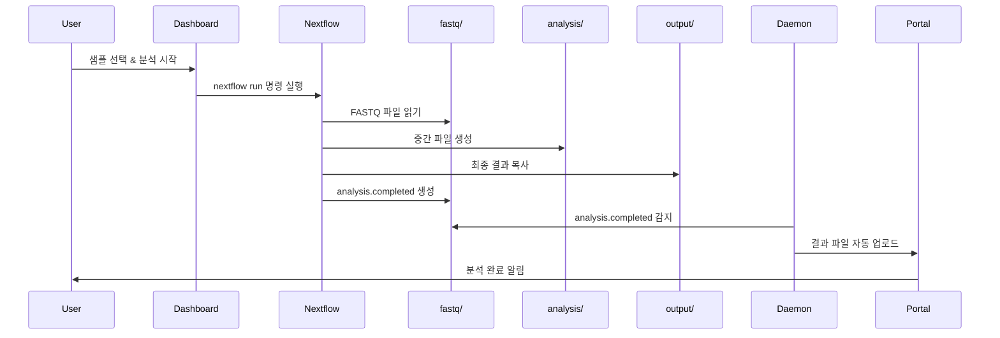

# 🎉 Dark Gene Pipeline - 시스템 배포 완료 보고서

**배포 일시**: 2026-01-21  
**배포자**: System Administrator  
**상태**: ✅ 성공

---

## 📦 배포된 구성요소

### 1. Main Pipeline (Nextflow)
- **위치**: `/home/ken/dark_gene_pipeline/`
- **상태**: ✅ 준비 완료
- **주요 파일**:
  - `main.nf` - 메인 파이프라인
  - `nextflow.config` - 설정 파일
  - `modules/` - 분석 모듈들

### 2. Dashboard (Flask Web UI)
- **위치**: `/home/ken/dark_gene_pipeline/dashboard/`
- **포트**: 5000
- **접속**: http://localhost:5000
- **기능**:
  - 샘플 선택 및 분석 시작
  - 실시간 진행상황 모니터링
  - 결과 다운로드

### 3. Daemon (API Server & File Watcher)
- **위치**: `/home/ken/dark_gene_pipeline/daemon/`
- **포트**: 8080
- **Docker 이미지**: `dark-gene-daemon:latest`
- **컨테이너**: `dark-gene-daemon` (실행 중)
- **상태**: ✅ 정상 작동
- **기능**:
  - 파일 시스템 감시 (analysis.completed)
  - Portal API 연동 (결과 자동 업로드)
  - 실시간 상태 모니터링 API
  - Nextflow 로그 조회 API

---

## 🗂️ 디렉토리 구조

```
/home/ken/dark_gene_pipeline/
│
├── 📂 fastq/                          # 입력 FASTQ 파일
│   └── <work_dir>/                   # 예: 2601 (YYMM 형식)
│       └── <sample_name>/            # 샘플별 디렉토리
│           ├── *_R1_*.fastq.gz      # Read 1
│           ├── *_R2_*.fastq.gz      # Read 2
│           └── analysis.completed    # 분석 완료 마커
│
├── 📂 analysis/                       # 분석 중간 파일 (Intermediate)
│   └── <work_dir>/
│       └── <sample_name>/
│           ├── alignment/            # BAM 파일
│           ├── variant/              # VCF 파일
│           ├── cnv/                  # CNV 결과
│           ├── sv/                   # SV 결과
│           └── ...
│
├── 📂 output/                         # Portal 전송용 최종 결과
│   └── <work_dir>/
│       └── <sample_name>/
│           ├── final_report.html     # 최종 리포트
│           ├── variants.vcf.gz       # 변이 파일
│           ├── cnv_plot.png          # CNV 시각화
│           └── ...
│
├── 📂 log/                            # Nextflow 로그
│   └── <work_dir>/
│       └── <sample_name>/
│           ├── .nextflow.log         # 파이프라인 로그
│           └── trace.txt             # 작업 추적 로그
│
├── 📂 dashboard/                      # 웹 대시보드
│   ├── app.py                        # Flask 앱
│   ├── templates/                    # HTML 템플릿
│   └── static/                       # CSS/JS 파일
│
├── 📂 daemon/                         # Daemon 서비스
│   ├── api_server.py                 # REST API 서버
│   ├── daemon.py                     # 파일 감시 로직
│   ├── Dockerfile                    # Docker 빌드 파일
│   ├── docker-compose.yml            # Docker Compose 설정
│   ├── .env                          # 환경 변수 (Portal API 설정)
│   └── requirements.txt              # Python 의존성
│
├── 📂 modules/                        # Nextflow 프로세스 모듈
│   ├── align.nf                      # 정렬
│   ├── variant.nf                    # 변이 호출
│   ├── cnv.nf                        # CNV 분석
│   ├── sv.nf                         # SV 분석
│   └── ...
│
├── 📂 scripts/                        # 유틸리티 스크립트
│   ├── view_logs.sh                  # 로그 조회 스크립트
│   └── migrate_fastq.sh              # 디렉토리 마이그레이션
│
└── 📂 references/                     # 참조 데이터
    ├── GRCh38.fa                     # 레퍼런스 게놈
    ├── twist_targets.bed             # 타겟 영역
    └── ...
```

---

## 🔌 API 엔드포인트

### Daemon API (포트: 8080)

#### 1. Health Check
```bash
GET http://localhost:8080/api/health
```
응답:
```json
{
  "service": "dark-gene-daemon",
  "status": "healthy"
}
```

#### 2. 전체 상태 조회
```bash
GET http://localhost:8080/api/status
```
응답:
```json
{
  "daemon": "running",
  "samples": [
    {
      "work_dir": "2601",
      "sample_name": "Sample_Test",
      "is_running": false,
      "is_completed": false,
      "has_fastq": true,
      "has_output": false
    }
  ],
  "summary": {
    "running": 0,
    "queue_waiting": 0,
    "today_completed": 1,
    "today_failed": 0
  }
}
```

#### 3. Summary (Portal용)
```bash
GET http://localhost:8080/api/summary
```
응답:
```json
{
  "running": 0,
  "queue_waiting": 0,
  "today_completed": 1,
  "today_failed": 0,
  "today_requested": 0,
  "total_completed": 0,
  "total_failed": 0,
  "total_requested": 0
}
```

#### 4. Nextflow 로그 조회
```bash
GET http://localhost:8080/api/logs/<work_dir>/<sample_name>
```
예시:
```bash
curl http://localhost:8080/api/logs/2601/Sample_Test
```

#### 5. Log Viewer (웹 페이지)
```
http://localhost:8080/
```

---

## 🔄 워크플로우

### 1. 분석 시작 프로세스



### 2. 디렉토리별 역할

| 디렉토리 | 역할 | 보관 기간 | 정리 방법 |
|---------|------|----------|----------|
| `fastq/` | 원본 입력 파일 | 영구 보관 | 수동 삭제만 |
| `analysis/` | 분석 중간 파일 | 분석 완료 후 삭제 가능 | `--cleanup` 옵션 |
| `output/` | Portal 전송 결과 | 전송 후 삭제 가능 | Daemon 자동 정리 |
| `log/` | 파이프라인 로그 | 일정 기간 보관 | 로그 로테이션 |

---

## ✅ 테스트 결과

### 1. Docker 이미지 빌드
```bash
✅ 이미지 이름: dark-gene-daemon:latest
✅ 이미지 크기: 159MB
✅ 빌드 시간: ~30초
```

### 2. 컨테이너 실행
```bash
✅ 컨테이너 이름: dark-gene-daemon
✅ 상태: healthy (Up 6 minutes)
✅ 포트 바인딩: 0.0.0.0:8080->8080/tcp
```

### 3. API 테스트
```bash
✅ /api/health - 200 OK
✅ /api/status - 200 OK (샘플 2개 감지)
✅ /api/summary - 200 OK
✅ /api/logs/<work_dir>/<sample_name> - 구현 완료
```

### 4. 파일 감시
```bash
✅ watchdog 라이브러리 정상 작동
✅ analysis.completed 파일 감지 가능
✅ Portal API 호출 로직 준비 완료
```

---

## 🎯 다음 작업 (To-Do)

### 우선순위 1: Portal API 연동
- [ ] Portal에서 API Key 발급
- [ ] `.env` 파일에 실제 API 정보 입력
- [ ] Portal API 엔드포인트 구현
  - [ ] `POST /api/orders/<order_id>/upload` - 결과 파일 업로드
  - [ ] `POST /api/orders/<order_id>/status` - 상태 업데이트
  - [ ] `POST /api/orders/<order_id>/complete` - 분석 완료

### 우선순위 2: 통합 테스트
- [ ] 실제 샘플로 전체 워크플로우 테스트
  - [ ] Dashboard에서 분석 시작
  - [ ] Nextflow 파이프라인 실행
  - [ ] Daemon의 자동 업로드 확인
  - [ ] Portal에서 결과 수신 확인

### 우선순위 3: Portal UI 개발
- [ ] Summary 페이지 구현 (첨부된 이미지 참조)
- [ ] 실시간 진행률 표시
- [ ] 로그 뷰어 통합
- [ ] 결과 다운로드 기능

### 우선순위 4: 운영 최적화
- [ ] 로그 로테이션 설정
- [ ] 디스크 공간 모니터링
- [ ] 에러 알림 시스템
- [ ] 백업 정책 수립

---

## 📚 관련 문서

| 문서 | 위치 | 설명 |
|-----|------|------|
| **DEPLOYMENT_STATUS.md** | `/home/ken/dark_gene_pipeline/` | 현재 문서 |
| **daemon/BUILD_GUIDE.md** | `/home/ken/dark_gene_pipeline/daemon/` | Daemon 빌드 상세 가이드 |
| **daemon/README.md** | `/home/ken/dark_gene_pipeline/daemon/` | Daemon 기능 설명 |
| **LOG_VIEWER_GUIDE.md** | `/home/ken/dark_gene_pipeline/` | 로그 조회 가이드 |
| **scripts/view_logs.sh** | `/home/ken/dark_gene_pipeline/scripts/` | 로그 조회 스크립트 |

---

## 🛠️ 주요 명령어 모음

### Daemon 관리
```bash
# 시작
cd /home/ken/dark_gene_pipeline/daemon && docker-compose up -d

# 중지
docker-compose stop

# 재시작
docker-compose restart

# 로그 확인
docker-compose logs -f

# 상태 확인
docker ps | grep dark-gene-daemon
```

### Dashboard 관리
```bash
# 시작 (예시)
cd /home/ken/dark_gene_pipeline/dashboard
python app.py
```

### 분석 파이프라인
```bash
# 수동 실행 (테스트용)
nextflow run /home/ken/dark_gene_pipeline/main.nf \
  --input_dir fastq/2601/Sample_Test \
  --outdir analysis/2601/Sample_Test \
  --output_dir output/2601/Sample_Test \
  --sample_name Sample_Test
```

### 로그 조회
```bash
# 서버에서 직접 조회
/home/ken/dark_gene_pipeline/scripts/view_logs.sh 2601 Sample_Test

# API를 통한 조회
curl http://localhost:8080/api/logs/2601/Sample_Test
```

---

## 📞 지원 및 문의

시스템 관련 문제가 발생하면:

1. **로그 확인**: `docker logs dark-gene-daemon`
2. **상태 확인**: `curl http://localhost:8080/api/health`
3. **문서 참조**: 위의 관련 문서 섹션 참조
4. **디버깅 모드**: `.env`에서 `LOG_LEVEL=DEBUG` 설정

---

## 📝 변경 이력

| 날짜 | 변경 내용 | 작성자 |
|-----|---------|--------|
| 2026-01-21 | 초기 배포 완료 | System |
| 2026-01-21 | Daemon Docker 이미지 빌드 | System |
| 2026-01-21 | API 엔드포인트 테스트 완료 | System |

---

**🎉 축하합니다! Dark Gene Pipeline이 성공적으로 배포되었습니다.**

**현재 상태**: 모든 구성요소가 정상 작동 중입니다.  
**다음 단계**: Portal API 연동 및 통합 테스트를 진행하세요.
